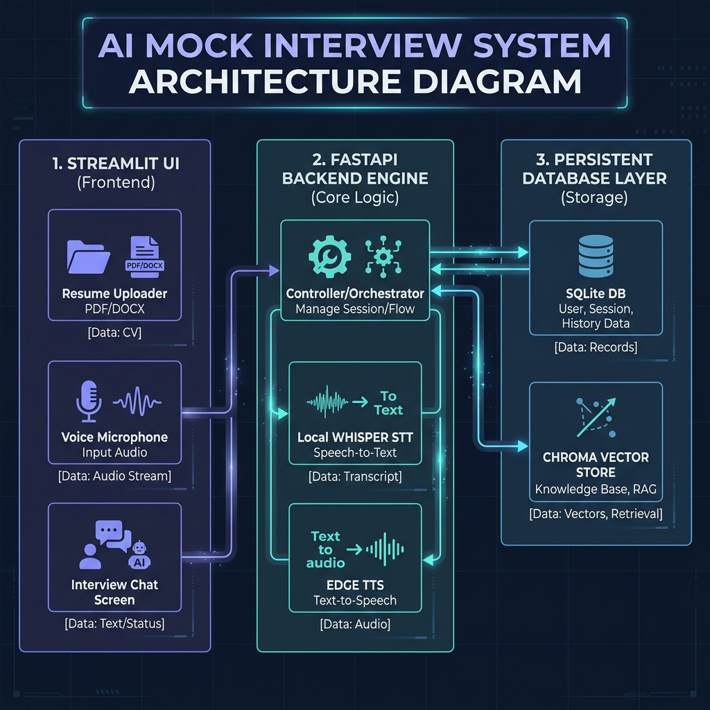
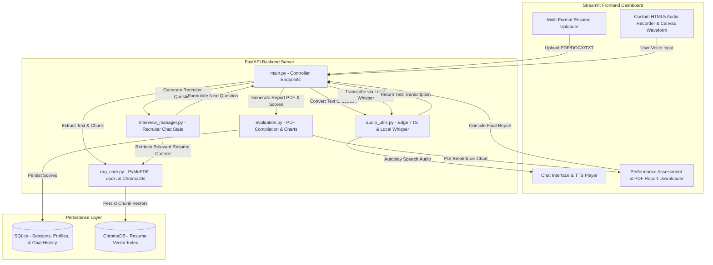

# AI Mock Interview Platform

A state-of-the-art, privacy-centric, local RAG-powered, and speech-enabled technical recruiter preparation platform. This application parses a candidate's resume (PDF, DOCX, or TXT), embeds and indexes it in a local vector database, conducts an interactive technical mock interview with natural text-to-speech voice generation and local Whisper speech-to-text recognition, and compiles a comprehensive performance dashboard complete with interactive score charts, ideal responses, and a downloadable PDF certificate report.

---

## 🎯 Selected Problem Statement
Preparing for technical interviews is a high-friction process for software developers and AI/ML engineers. Generic questionnaires fail to assess candidates on their actual projects, stack, and experience. Key challenges include:
- **Lack of Personalization**: Standard practice questions are static and do not align with a candidate's specific resume claims.
- **Real-Time Pacing under Pressure**: Typing is not a realistic simulation of a live, spoken recruiter conversation.
- **Vague, Unactionable Feedback**: Standard assessments do not provide ideal answers mapped to their actual responses or highlight specific gaps.
- **Cost & Privacy Concerns**: Uploading proprietary resumes to black-box web platforms raises privacy issues, and continuous API costs accumulate quickly.

This project solves these issues by establishing a **RAG-powered conversational mock recruiter** that leverages local embeddings, offline Speech-to-Text models, and a hybrid API design to provide a personalized, free, and highly interactive prep panel.

---

## 🎥 Demo Video Link
📺 **[Watch the Live Demo Video on YouTube/Google Drive](https://www.youtube.com/)** *(Replace this link with your actual demo url)*

---

## 🛠️ Tech Stack Used

- **Frontend Interface**: Streamlit (Sleek Slate-dark mode grid styling)
- **Backend API Server**: FastAPI (Uvicorn HTTP server)
- **RAG Vector Database**: ChromaDB (Local persistent instance)
- **Text Embeddings**: HuggingFace `all-MiniLM-L6-v2` (Local sentence-transformers)
- **Speech recognition (STT)**: OpenAI Whisper (`tiny` model running locally)
- **Speech generation (TTS)**: Microsoft Edge Text-to-Speech (`edge-tts`)
- **Primary LLM Recruiter Engine**: Google Gemini API (`gemini-2.5-flash` developer key)
- **Secondary LLM Fallback Engine**: Groq API (`llama-3.3-70b-versatile`)
- **Assessment Visualization**: Pandas & Streamlit Interactive Charts
- **PDF Exporter Engine**: `fpdf2` & Matplotlib (Agg headless backend)
- **Local Database**: SQLite3 (Session, Profile, and Chat turn persistence)

---

## 🧠 Backend Architecture / System Design

The application separates concerns cleanly into a **Streamlit Client**, a **FastAPI Controller**, and a local **Persistence Layer** (SQLite & ChromaDB):



### Detailed System Workflow (Mermaid Flowchart)


---

## 🔄 Implementation Approach & Workflow

We adopted a structured, phase-based engineering workflow to build the platform from the ground up:
1. **Phase 1: Project Setup & Env**: Standardized a unified FastAPI-Streamlit project directory layout, established the python virtual environment, and configured the fallback API parameters.
2. **Phase 2: RAG Parsing Engine**: Programmed the text parsing route matching `.pdf`, `.docx`, and `.txt` files to self-contained extractors, chunked contents using LangChain's `RecursiveCharacterTextSplitter`, and indexed vectors locally in ChromaDB.
3. **Phase 3: Conversational Personas**: Programmed the recruitment chatbot persona logic (system persona, difficulty rules, conversation question counts, and retrieval context injection).
4. **Phase 4: Speech Ingestion & TTS**: Built the browser-based mic recorder and coupled it with local OpenAI Whisper transcription and asynchronous Edge-TTS audio rendering.
5. **Phase 5: Performance Evaluation**: Structured a detailed prompt to generate candidate assessments in JSON, mapped scoring categories, compiled custom bar charts, and compiled reports into a FPDF layout.
6. **Phase 6: Custom Streamlit Interface**: Tailored the dark Slate user interface with chat histories, progress tracking bars, and responsive cards.
7. **Phase 7: Optimization & Interactive Features**: Added real-time visual waves inside the recording block, replaced static report visuals with interactive dashboard charts, and reinforced JSON boundaries to prevent token truncation bugs.

---

## ⚡ Features & Functionalities

1. **Multi-Format Resume RAG**: Seamlessly upload and clean text from **PDF**, Microsoft Word (**DOCX**), and Plain Text (**TXT/MD**) resumes, slicing contents into overlapping chunks indexed in a local database.
2. **Interactive Audio Canvas Waveform**: Speak your answers into a web-microphone recorder that draws live audio frequency waves on a custom canvas when recording is active.
3. **Smart Recruiter Persona**: Adapts to the auto-classified resume engineering role (e.g. *AI/ML Engineer*, *Software Engineer*) with customizable difficulty (Junior, Mid-Level, Senior) and duration parameters.
4. **Resilient Hybrid Fallback**: Implements automatic, silent fallback to Groq (`llama-3.3-70b-versatile`) if the primary Google Gemini developer key encounters rate limits (429 Quota Exceeded).
5. **Autogenerated PDF Feedback Certificates**: Generates downloadable PDF reports detailing candidate overall scores, strengths, improvement areas, ideal answers, and matplotlib score breakdown charts.
6. **Robust JSON Boundary Isolation**: Parses structured scoring dictionaries from LLM responses even if conversational text or markdown code blocks are wrapped around the JSON.

---

## 🚀 Setup Instructions & Installation

### 📋 Prerequisites
- **Python**: Python 3.10 to 3.14
- **System Utilities**: `ffmpeg` (required by Whisper for audio decoding)

#### Install system utilities (macOS):
```bash
brew install ffmpeg
```

---

### 1. Installation Steps

Clone the repository and navigate to the project directory:
```bash
git clone <repository-url>
cd AI_Mock_Interview
```

Create a virtual environment and install project dependencies:
```bash
python3 -m venv env
source env/bin/activate
pip install --upgrade pip
pip install -r requirements.txt
```

*(For macOS Users: If you encounter SSL certificate verification errors when downloading Whisper or embedding models, run the Python certificates installation command)*
```bash
"/Applications/Python 3.14/Install Certificates.command"
```

---

### 2. Environment Variables Required

Create a `.env` file in the root directory. You can copy the template from `.env.example`:
```bash
cp .env.example .env
```

Open the `.env` file and configure your API keys:
```env
# AI Mock Interview Platform Environment Configuration

# LLM API Keys (Provide at least one)
# Generate Gemini Key: https://ai.google.dev/
GEMINI_API_KEY="your-google-gemini-key"

# Generate Groq Key: https://console.groq.com/
GROQ_API_KEY="your-groq-api-key"

# Local Server Settings
PORT=8000
HOST=127.0.0.1
```

---

### 3. Run the Application

Start both the FastAPI backend and Streamlit UI in separate terminal windows:

#### Terminal 1: Launch FastAPI Backend
```bash
source env/bin/activate
uvicorn app.api.main:app --reload --port 8000
```
*The interactive API documentation is available at `http://127.0.0.1:8000/docs`.*

#### Terminal 2: Launch Streamlit Frontend
```bash
source env/bin/activate
streamlit run app/ui/app.py
```
*Open your browser and navigate to `http://localhost:8501` to start mock interviewing.*

---

## 🧪 Testing & Verification

### Running Automated Unit Tests
To verify vector operations, text splitting, resume parsing, and DB read/writes:
```bash
source env/bin/activate
python3 -m unittest tests/test_pipeline.py
```

### Running Interactive CLI Recruiter
To run a text-based simulation in your terminal window (no browser required):
```bash
source env/bin/activate
python3 cli_test.py
```
