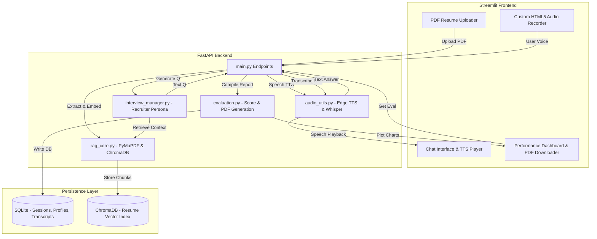

# AI Mock Interview Platform

A state-of-the-art, 100% free tech stack, local RAG-powered, speech-enabled AI Mock Interview Platform. It parses a PDF resume, indexes it into a local vector database, simulates a professional mock recruiter (voice-enabled), transcribes responses locally using OpenAI Whisper, and generates a structured feedback assessment dashboard complete with study recommendations and a downloadable PDF certificate report.

---

## Key Features

1. **RAG-Enabled Recruiting Core**: Indexes resume text in ChromaDB using HuggingFace `all-MiniLM-L6-v2` embeddings to customize questions based on resume claims.
2. **Dynamic Speech Integration**: Speak with the AI interviewer using Edge Text-to-Speech (realistic pacing) and local OpenAI Whisper transcription.
3. **Custom HTML5 Web Recorder**: A lightweight, robust recording component built directly with browser media APIs—no unstable third-party widgets.
4. **Structured Feedback Engine**: Evaluates answers based on *Technical Accuracy*, *Communication style*, and *Role Relevance*, grading overall preparedness out of 100.
5. **Autogenerated PDF Feedback Certificates**: Generates downloadable PDF reports detailing candidate scores, strengths, improvement areas, ideal answers, and matplotlib score breakdown charts.

---

## System Architecture



---

## Tech Stack Specs

- **Frontend**: Streamlit
- **Backend**: FastAPI & Uvicorn
- **Vector Index**: ChromaDB (Local persistent client)
- **Embeddings**: HuggingFace `all-MiniLM-L6-v2` (sentence-transformers)
- **STT**: OpenAI Whisper (`tiny` or `base` model running locally)
- **TTS**: Microsoft Edge Text-to-Speech (`edge-tts`)
- **LLM Engine**: Google Gemini API (Free tier developer key) or Groq API (Llama 3)
- **Report Generation**: `fpdf2` & `matplotlib`
- **Database**: SQLite3

---

## Installation & Setup

### 1. Clone the Project & Navigate
```bash
git clone <repository-url>
cd AI_Mock_Interview
```

### 2. Configure Environment variables
Create a `.env` file in the root directory:
```env
# LLM API Keys (Provide at least one)
GEMINI_API_KEY="your-gemini-api-key"
GROQ_API_KEY="your-groq-api-key"

# Server Settings
PORT=8000
HOST=127.0.0.1
```

### 3. Build Virtual Environment & Install Dependencies
```bash
python3 -m venv env
source env/bin/activate
pip install --upgrade pip
pip install -r requirements.txt
```

*Note: If on macOS, ensure you install Python certificates so pip and model loaders can download assets securely:*
```bash
"/Applications/Python 3.14/Install Certificates.command"
```

---

## Running the Application

To run the full stack, start both the FastAPI backend and Streamlit frontend in separate terminals:

### 1. Launch FastAPI Backend
```bash
source env/bin/activate
uvicorn app.api.main:app --reload --port 8000
```
The API docs will be available at `http://127.0.0.1:8000/docs`.

### 2. Launch Streamlit UI
```bash
source env/bin/activate
streamlit run app/ui/app.py
```
Open your browser and navigate to `http://localhost:8501`.

---

## Testing & Verification

### Running Automated Unit Tests
Verify resume parsing, text cleaning, text splitting, database operations, and ChromaDB vector queries:
```bash
source env/bin/activate
python3 -m unittest tests/test_pipeline.py
```

### Running Interactive CLI Mock Recruiter
Verify conversation history tracking and RAG retrieval pipelines in the terminal without opening a browser:
```bash
source env/bin/activate
python3 cli_test.py
```
